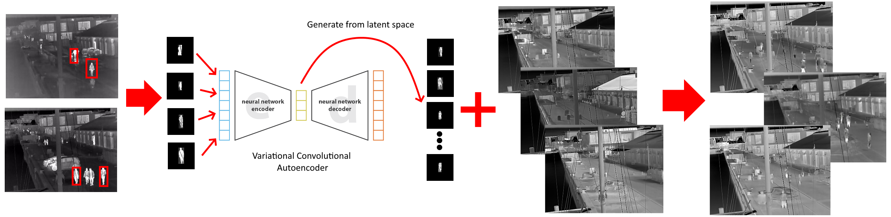

# Variational Autoencoder Synthetic Surveillance Data Generation



## Requirements

- OpenCV
- Python 3
- Numpy
- Pytorch (1.5.1 or heigher)
- PIL

The Long-Term Thermal Dataset https://www.kaggle.com/datasets/ivannikolov/longterm-thermal-drift-dataset is used as a source for the images. The annotations were created using the LabelImg open-source software https://github.com/tzutalin/labelImg

Variational Convolutional Autoencoder (VAE) is a modified and extended version of the one presented in the repo - https://github.com/bhpfelix/Variational-Autoencoder-PyTorch

## Usage

Training a Variational Convolutional Autoencoder (VAE) on thermal sub-images of humans from a surveillance camera and generating new synthetic images using the outputs from the VAE and a dataset of generated backgrounds.

The background images were created by using the images from the Long-Term Thermal Dataset, by using a median filter from on every 50 images of the dataset to remove moving objects and leave only the backgrounds. The number of images used for generating each background can be twicked, if foreground objects like cars, sitting people, etc. are still visible. A good tutorial how to create background images using median filter https://www.youtube.com/watch?v=fn07iwCrvqQ

The folders in the repo are as follows:
 -background_images - all backgrounds that will be used for the synthetic image generation go here
 -data_preprocessing - the input images and annotated bounding boxes go here:
  -bbox_images - sub-images extracted from the input images and bounding boxes. The images are padded with black borders to a square shape
  -bboxes - annotated bounding box files containing the x,y positions and the width,height of the bounding boxes
  -images - the input large images from which the small sub-images will be extracted
 -generated_data - folder containing subfolders for images and labels of the new synthetically generated images and their annotations
 -saved_model - folder that contains the saved models from training the VAE, both after every epoch, as well as the best one are saved
 

**Clone the repo**
```bash
git clone https://github.com/IvanNik17/Variational_Autoencoder_Generate_Synthetic_Surveillance_Data.git
```
All the necessary images and annotations are already added to the repo. If you want to try out the proposed algorithms on a custom dataset you can add your own images and annotations in the necessary folders and change the imports in the code. 

**Run crop_people.py from data_preprocessing folder**
Run the script to generate the training data and annotations used for training and synthetic generation. In the script you can choose to visualize the images with bounding boxes or the sub-image ROIs

```bash
python crop_people.py
```
**Train the VAE using the cropped data**
Run the training script train.py to train the autoencoder. In the script you can change the number of epochs, the batch size, as well as if the model should be trained from scratch or the training should continue from a specified model file. The script provides the a list of all the calculated losses for each epoch for analysis.

```bash
python train.py
```
**Test the VAE and visualize results**
After training the performance of the VAE can be visually analysed through the test script. It currently uses the training data as test data as well, but easily the training data can be separated into two parts. The script visualizes the input, the reconstructed output and the difference between them, as well as the MSE.

```bash
python test.py
```
**Generate synthetic images**
The trained model, the background images and the training sub-images are then used to generate new images with people, together with annotations for them.
The number of generated images can be set using the "num_images" variable, the number of interpolated synthesized images between two input images can be set by changing the "num_lin_interp" variable and the start number of the generated saved images can be set with "start_number" variable, in case more images need to be added to a synthetic dataset. All images in the background_images folder will be used for the generation. The blending between the background and the generated foreground people from the VAE is done through Poisson blending. Additional gaussian blur or direct pasting can be used for this. We have seen that Poisson blending generates nicely blended images, aibeit with some ghosting, because of the tight bounding boxes. We use the method for blending suggested in the paper ** Cut, Paste and Learn: Surprisingly Easy Synthesis for Instance Detection ** - the implementation for which can be found here - https://github.com/debidatta/syndata-generation

```bash
python sequenceGeneration.py
```

## Results


